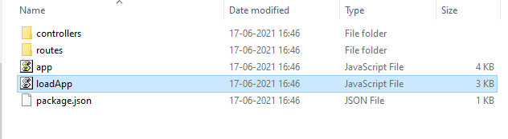
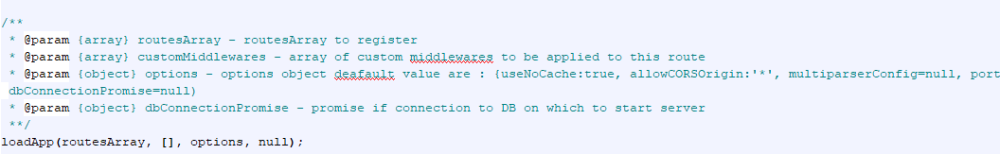

# NODEBOOTSTRAPPER
Bootstrapper project to generate node server from swagger
============================


Features
--------------------------
- Parses Swagger specs in **YAML** format
- Generates code for [Swagger 2.0 schema](https://github.com/OAI/OpenAPI-Specification/blob/master/schemas/v2.0/schema.json)
- Generates all routes, controller stubs and registers them.
- Generates `package.json` with required dependencies
- Inbuilt features like request santisation, use JSON parser, use URL encoded parser
- To get up and running you just need to update the `controller stubs` in `controllers` directory

Exposed Interface
--------------------------
- Primarily Exposes method `loadApp` in `app.js`. Although code can be modified as per need.
- The method takes list of routes with specific routes to apply or validator to apply
- Also list of routes to be applied to entire app can be passed
- Options to enable features
```javascript
options = {
    useNoCache: true,
    allowCORSOrigin: "*",
    multiparserConfig: null,
    port: 8080,
    useJsonParser: true,
    useUrlEncodedParser: false,
  }
```
-The last argument is a connection promise, like DB connection which should be established before API comes-up.


Usage
--------------------------
Following Sytax can be used:

```javascript
node index.js outpuDirectory -s locationToSwagger.yaml [-a apiName]
```
When API name is not specified, the name is taken from the Swagger title.
```javascript
swagger.title="API NAME"
generatedAPIName="API-NAME"
```


> **WARNING:** Everytime code is run, the contents of the target directory will be overwritten Be very careful here!


Screenshots
--------------------------
Image of Generated Directories and files:



Image of Method exposed in `app.js` with routes registered:

